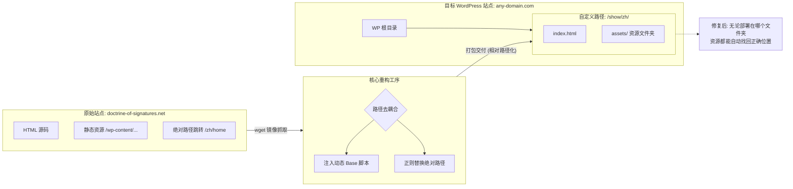

# 目标站点

原中文地址: https://doctrine-of-signatures.net/zh/home/

原英文地址: https://doctrine-of-signatures.net/en/home-en/

用于验证的vercel 地址 =>  https://mirror-of-doctrine.vercel.app/resource/doctrine-of-signatures.net/zh/home/index.html


# 需求描述

## 目标

将 https://doctrine-of-signatures.net/zh/home/(中文) 和  https://doctrine-of-signatures.net/zh/home/(英文) 对应的页面复制下来, 使其能发布到任意 wordpress 站点. 站点域名和路径可以是任意的, 例如换成 a.com/show/zh, 或者 b.com/display/tg, 但期望其打开效果和原始站点一模一样

最终会交付一个文件夹, 里面为一系列 html 文件, 部署到服务器, 打开路径后可以直接访问, 且能正常跳转

## 已确认事项

1. 页面仅极少部分写死了doctrine-of-signatures.net域名, 且均与加载 js/css 无关
2. 页面存在写死路径的情况,例如以/开头, 这会导致克隆下的资源无法被迁移到其他父路径
3. 已通过该命令, 将所有静态资源及 html, 下载到了`resource/doctrine-of-signatures.net` 目录中
    ```
    wget --mirror --convert-links --adjust-extension --page-requisites --no-parent --directory-prefix=zh/home https://doctrine-of-signatures.net/zh/home/
    ```

## 待确认事项

1.  如何进行该工作
2.  使用 markdown 将工作流程绘制出来

## 本地调试环境

当前仓库已提供基于 Express 的本地预览服务，用于模拟 Nginx / WordPress 常见的静态访问行为：

1. 自动将目录请求映射到 `index.html`
2. 自动补齐目录尾部 `/`，便于验证相对路径资源
3. 支持直接访问 `index.html`，也支持访问目录路径
4. 默认首页跳转到 `/zh/home/`
5. 支持额外挂载到任意父路径，便于验证子目录部署

启动方式：

```bash
npm install
npm run dev
```

默认访问地址：

```text
http://127.0.0.1:3000/zh/home/
```

如需模拟部署到子路径，例如 `/show/zh`：

```bash
MOUNT_PATH=/show/zh npm run dev
```

此时可访问：

```text
http://127.0.0.1:3000/show/zh/zh/home/
```

说明：

1. `SITE_ROOT` 默认为 `resource/doctrine-of-signatures.net`
2. `START_PAGE` 默认为 `/zh/home/`
3. `HOST` 默认为 `127.0.0.1`
4. `PORT` 默认为 `3000`


# 执行路径



# 英文版过程记录

1.  寻找空文件夹, 下载英文相关资源

wget --mirror --convert-links --adjust-extension --page-requisites --no-parent --directory-prefix=zh/home https://doctrine-of-signatures.net/en/home-en/

2.  使用 idea, 比较中文/英文版之间的区别, 同步至英文版
    1.  credits-en.html 和 index.html 平级, 以便统一层级
    2.  在credits-en.html/index.html文件中, 
        1.  `'https://doctrine-of-signatures.net/wp-`替换为`'../../wp-`
        2.  `https://doctrine-of-signatures.net/_static/index.html??` 替换为`../../_static/index.html..`
3.  全部英文文件中, `%3F`替换为`?`


# 存在问题

1.  由于使用了相对地址计算资源位置, 因此入口页不能使用简略形式,只能使用`https://mirror-of-doctrine.vercel.app/resource/doctrine-of-signatures.net/zh/home/index.html` 进入. 若忽略 index.html, 会导致资源加载异常
2.  在测试站点上, 由于文件名过长, 出现了 404 . 不确定 word-press 站点是否有同样问题
https://mirror-of-doctrine.vercel.app/resource/doctrine-of-signatures.net/_static/index.html..-eJxlzNEKgzAMheEXWhsmw3ojPosrQWJtWppI2dtbwbGBt%252F85fDUbn1iRFfK2L8QCKy4GN4ytpWICKcwiqG0QuLqAKPnw+f7sKo96l35KLulPqfjOsw9ntWVnpYg2EjdliuPTuX4YXr3rDnsUOkE=.css
3.  右侧导航栏点击能力未生效